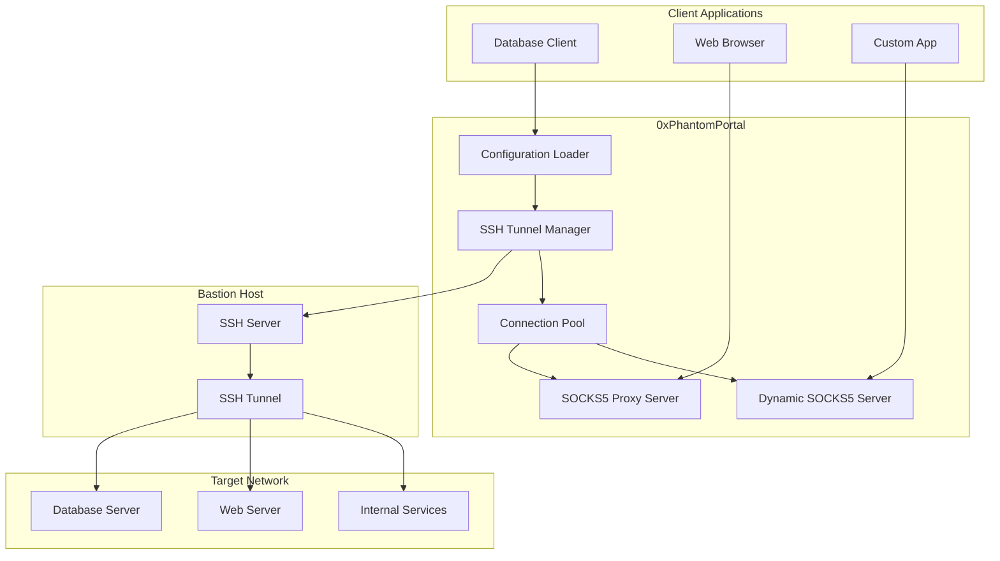
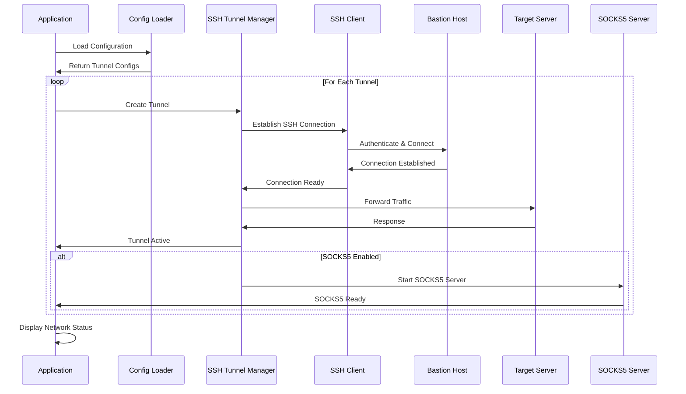
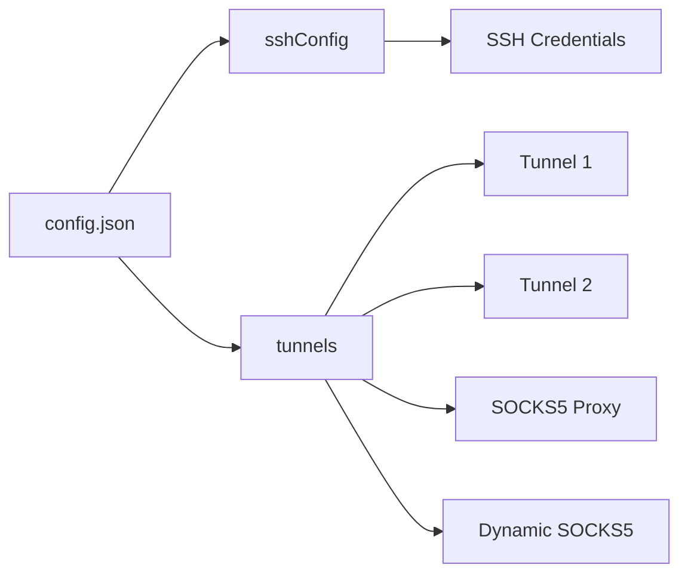
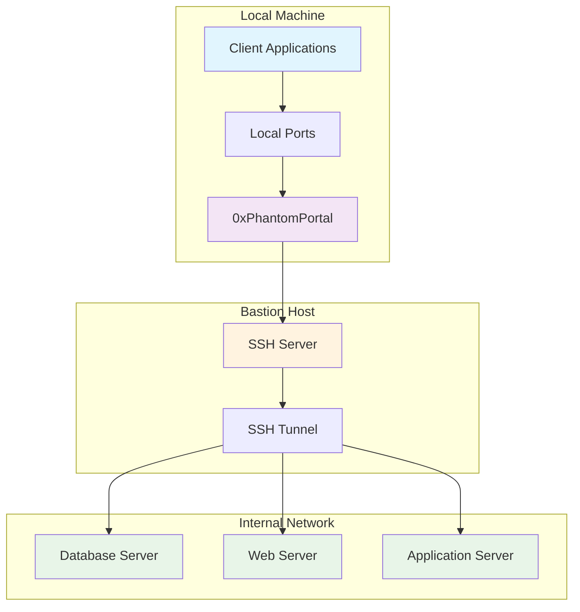
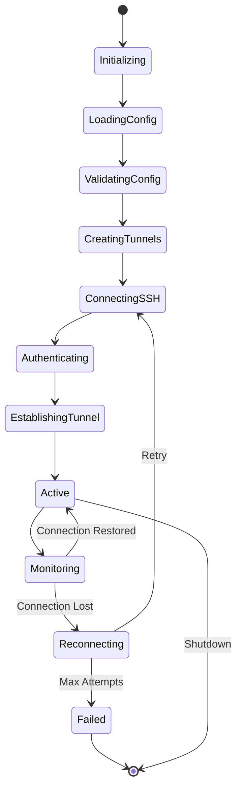

# 0xPhantomPortal

> **Advanced SSH Tunnel Service** for secure network tunneling through bastion hosts with SOCKS5 proxy support and dynamic routing capabilities.

[](https://nodejs.org/)
[](https://www.typescriptlang.org/)
[](LICENSE)

## 🏗️ Architecture Overview



## 🔄 System Flow



## 🚀 Quick Start

### Prerequisites

- **Node.js** >= 18.0.0
- **Yarn** package manager
- **SSH access** to bastion host

### Installation

```bash
# Clone the repository
git clone <repository-url>
cd 0xPhantomPortal

# Install dependencies
yarn install

# Copy configuration template
cp config-template.json config.json

# Edit configuration
nano config.json
```

### Basic Usage

```bash
# Development mode
yarn dev

# Production mode
yarn build && yarn start

# Watch mode (auto-restart on changes)
yarn dev:watch
```

## ⚙️ Configuration

The application uses a JSON configuration file to define SSH tunnels and proxy settings.

### Configuration Structure



### Basic Configuration

```json
{
  "sshConfig": {
    "sshHost": "your-bastion-host.com",
    "sshPort": 22,
    "sshUsername": "your-username",
    "sshPassword": "your-password"
  },
  "tunnels": [
    {
      "name": "Database Server",
      "remoteHost": "internal-db-server.com",
      "remotePort": 5432,
      "localPort": 15432,
      "autoReconnect": true
    }
  ]
}
```

### Advanced Configuration

```json
{
  "sshConfig": {
    "sshHost": "bastion.example.com",
    "sshPort": 22,
    "sshUsername": "user",
    "sshPassword": "password"
  },
  "tunnels": [
    {
      "name": "Database Tunnel",
      "remoteHost": "db.internal",
      "remotePort": 5432,
      "localPort": 15432,
      "autoReconnect": true,
      "maxReconnectAttempts": 5,
      "reconnectDelay": 5000
    },
    {
      "name": "SOCKS5 Proxy",
      "remoteHost": "localhost",
      "remotePort": 1080,
      "localPort": 10800,
      "enableSocks5": true,
      "socks5Port": 10801,
      "socks5Host": "localhost",
      "autoReconnect": true
    },
    {
      "name": "Dynamic SOCKS5",
      "remoteHost": "localhost",
      "remotePort": 1081,
      "localPort": 10810,
      "enableDynamicSocks5": true,
      "dynamicSocks5Port": 10811,
      "dynamicSocks5Host": "localhost",
      "autoReconnect": true
    }
  ]
}
```

## 🔧 Configuration Options

### SSH Configuration

| Option | Type | Default | Description |
|--------|------|---------|-------------|
| `sshHost` | string | - | SSH bastion host address |
| `sshPort` | number | 22 | SSH port |
| `sshUsername` | string | - | SSH username |
| `sshPassword` | string | - | SSH password |
| `sshPrivateKey` | string | - | Private key for authentication |
| `sshPassphrase` | string | - | Passphrase for private key |

### Tunnel Configuration

| Option | Type | Default | Description |
|--------|------|---------|-------------|
| `name` | string | - | Unique tunnel identifier |
| `remoteHost` | string | - | Target host to tunnel to |
| `remotePort` | number | - | Target port to tunnel to |
| `localPort` | number | - | Local port to bind to |
| `autoReconnect` | boolean | true | Enable automatic reconnection |
| `maxReconnectAttempts` | number | 5 | Maximum reconnection attempts |
| `reconnectDelay` | number | 5000 | Delay between reconnection attempts (ms) |

### SOCKS5 Configuration

| Option | Type | Default | Description |
|--------|------|---------|-------------|
| `enableSocks5` | boolean | false | Enable SOCKS5 proxy server |
| `socks5Port` | number | localPort + 1000 | SOCKS5 server port |
| `socks5Host` | string | localhost | SOCKS5 server host |
| `socks5Auth` | object | - | SOCKS5 authentication |

### Dynamic SOCKS5 Configuration

| Option | Type | Default | Description |
|--------|------|---------|-------------|
| `enableDynamicSocks5` | boolean | false | Enable dynamic SOCKS5 tunneling |
| `dynamicSocks5Port` | number | localPort + 2000 | Dynamic SOCKS5 server port |
| `dynamicSocks5Host` | string | localhost | Dynamic SOCKS5 server host |

## 🌐 Network Topology



## 🔄 Connection Lifecycle



## 🛠️ Development

### Project Structure

```
0xPhantomPortal/
├── src/
│   ├── index.ts              # Main entry point
│   ├── config.ts             # Configuration loader
│   ├── config-loader.ts      # File-based config loader
│   └── proxy.ts              # SSH tunnel service
├── config.json               # Configuration file
├── config-template.json      # Configuration template
├── dist/                     # Compiled JavaScript
├── logs/                     # Log files
├── package.json              # Package configuration
├── tsconfig.json            # TypeScript configuration
└── README.md                # This file
```

### Available Scripts

| Script | Description |
|--------|-------------|
| `yarn build` | Compile TypeScript to JavaScript |
| `yarn start` | Run the compiled JavaScript |
| `yarn dev` | Run TypeScript directly with ts-node |
| `yarn dev:watch` | Run with file watching |
| `yarn clean` | Remove build artifacts |

### Environment Variables

| Variable | Description | Default |
|----------|-------------|---------|
| `PHANTOM_CONFIG_FILE` | Custom config file path | `config.json` |

```bash
# Use custom config file
PHANTOM_CONFIG_FILE=./my-config.json yarn dev
```

## 📊 Monitoring & Logging

The application provides comprehensive logging and monitoring capabilities:

- **Real-time tunnel status** with visual indicators
- **Connection health monitoring** with automatic reconnection
- **SOCKS5 proxy statistics** and usage metrics
- **Detailed error logging** with stack traces
- **Performance metrics** for tunnel throughput

## 🔒 Security Features

- **SSH key-based authentication** support
- **Encrypted tunnel communication** through SSH
- **SOCKS5 authentication** for proxy access
- **Connection isolation** between tunnels
- **Automatic credential rotation** support

## 🚨 Troubleshooting

### Common Issues

| Issue | Solution |
|-------|----------|
| SSH connection fails | Verify credentials and network connectivity |
| Port already in use | Change local port in configuration |
| SOCKS5 proxy not working | Check firewall settings and port availability |
| Tunnel disconnects frequently | Increase `reconnectDelay` and `maxReconnectAttempts` |

### Debug Mode

```bash
# Enable debug logging
DEBUG=phantom-portal:* yarn dev
```

## 📝 License

This project is licensed under the MIT License - see the [LICENSE](LICENSE) file for details.

## 🤝 Contributing

1. Fork the repository
2. Create a feature branch (`git checkout -b feature/amazing-feature`)
3. Commit your changes (`git commit -m 'Add amazing feature'`)
4. Push to the branch (`git push origin feature/amazing-feature`)
5. Open a Pull Request

## 📞 Support

For support and questions:

- Create an issue on GitHub
- Check the troubleshooting section
- Review the configuration examples

---

**Built with ❤️ for secure network tunneling**
